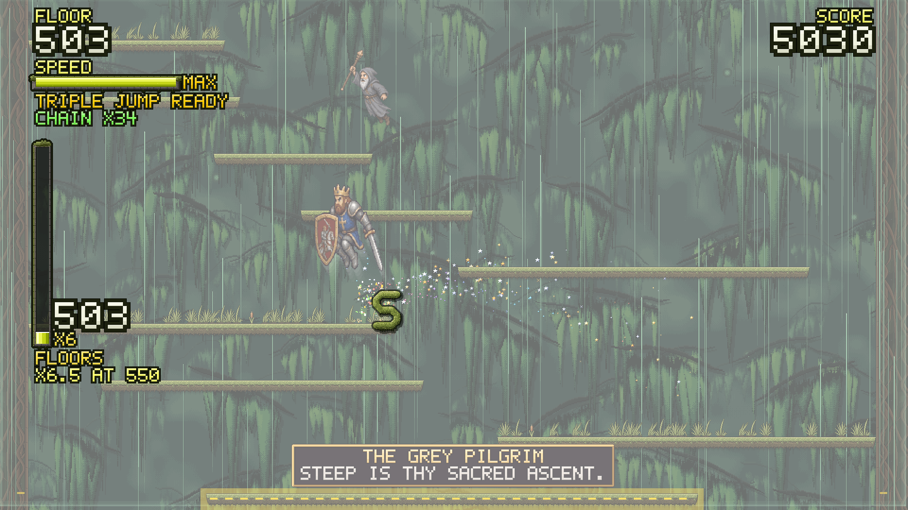
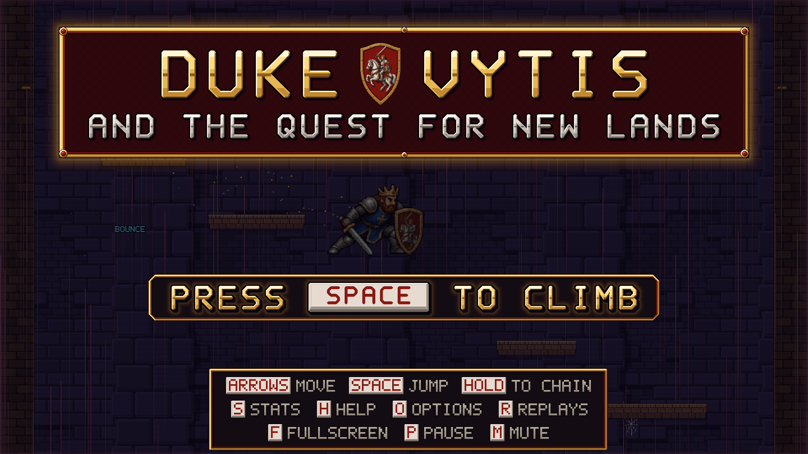

# Duke Vytis and the Quest for New Lands



**A pixel-art tower climber.** You are Duke Vytis, a crowned grand duke in steel plate, and
the tower you are climbing is on fire. Run, jump and bounce off the walls up an endless tower
through twelve worlds -- from the Basement to the Zenith -- before the rising flames catch you.

---

## Download and play (Windows)

1. Open the **[latest release](https://github.com/justas-reverb/duke-vytis/releases/latest)**
   and download **`Duke-Vytis-1.0.0-setup.exe`**.
2. Run it. Windows will probably say *"Windows protected your PC"*: the installer is not
   code-signed (a signing certificate costs money every year), so Windows does not know it
   yet. Click **More info**, then **Run anyway**.
3. Choose where to install it, or keep the default. No administrator rights are needed. It
   adds a **Duke Vytis** shortcut to your desktop and Start menu.

Rather not install anything? Download **`Duke-Vytis-1.0.0-portable.exe`** from the same page
instead: one file, double-click it and play.

**You need** Windows 10 or 11 (64-bit), and a keyboard or a gamepad (Xbox, PlayStation, Steam
Deck and other standard pads all work). **To uninstall:** Settings > Apps > Duke Vytis >
Uninstall.

### Android (test build)

Download **`Duke-Vytis-1.0.0.apk`** from the same release page on your phone and open it.
Android will ask once whether the app you opened it from (your browser, or Files) may install
apps -- it is not from the Play Store -- so allow it. Hold the phone sideways: the game draws
its own keys on the screen, < and > to run, a big SPACE to jump (hold it to chain), ESC to
pause, and along the top whatever keys the screen you are on offers. Android 7 or newer.

It is a test build: it has been played on an emulator, not yet on many real phones, and
saving replays to a file does not work in it yet. Tell us how it runs on yours.

---

## How to play

Climb as high as you can. The moment you leave the ground the floor below you catches fire,
and it rises faster the higher you get -- stand around and it will catch you.



| | Keyboard | Gamepad |
|---|---|---|
| Run | `←` `→` (or `A` `D`) | D-pad or left stick |
| Jump | `Space` (or `↑` `W` `Z`) | `A` |
| Pause | `P` or `Esc` | `Start` |
| Stats · Help · Options | `S` · `H` · `O` | `Y` · `X` · `Back` |
| Replays | `R` | `RB` |
| Fullscreen · Mute | `F` · `M` | |

**What gets you high:**

- **Speed is height.** Run to fill the SPEED bar: the faster you are going when you jump,
  the higher you go. A standing jump barely clears a couple of floors; a jump at full speed
  flies.
- **Hold jump to chain.** Keep the jump key down and you jump again the instant you land.
- **Air jumps.** With the SPEED bar full, tap jump in mid-air for a double jump -- and, deep
  into a combo, a triple.
- **Use the walls.** Hit a side wall in mid-air and you bounce off it, keeping your speed.
  Inside a combo, a bounce gives you even more.
- **Combos.** Land two or more floors above where you jumped from and a combo starts. Keep
  every hop that big and keep moving -- standing still ends it. The longer the combo, the
  more it pays.
- **Every 200 floors the world changes**: the sky, the backdrop, the ledges and the music.
  Reach floor 2,300, the Zenith, and you *ascend* -- a little higher and swifter -- and the
  tower goes on.

Along the way, companions join you (the first waits at floor 350), there are 28 awards to
win, and every run is kept as a replay you can watch again or race against as a ghost.

**The full guide** -- every rule, every option, all 28 awards -- is
**[docs/PLAYING.md](docs/PLAYING.md)**.

---

## What is in it

- **Twelve zones**, Basement to Zenith, each with its own backdrop, ledges, furniture, HUD and
  lettering -- and past the Zenith they come round again, reshuffled, forever
- **Momentum movement**: run-up, wall bounces, held-jump chains, double and triple jumps
- **Six companions** who climb beside you for a while and cheer you on in Shakespearean English
- **A proper death**: the fall down the whole shaft, and a scoreboard dressed in the zone you
  fell in
- **Replays** of every run, an instant replay from the scoreboard, and races against your best
  run's ghost
- **28 awards**, lifetime statistics, and options for jump speed, gravity, ledge width and
  difficulty
- **Its own music**, which follows the climb, and sound effects in the music's key
- **Keyboard and gamepad** on the desktop, on-screen touch keys on a phone, and sharp at 4K
  and high refresh rates

---

## How it is made

Duke Vytis is written in **plain JavaScript**: ES modules and one `<canvas>`, with no game
engine, no framework and no build step. [Electron](https://www.electronjs.org/) wraps it as a
Windows application, and the same files run in any modern browser.

- **A fixed 240 Hz simulation.** The game moves 240 times a second whatever the screen does,
  and draws smooth in-between frames on top, so it plays the same on a 60 Hz laptop and a
  240 Hz monitor.
- **Deterministic replays.** A run is recorded as its inputs and its seed. Played back through
  the same simulation they reproduce the run exactly, which is what lets you race a ghost.
- **A generated tower.** Every run's tower is built from a seed, and every floor is proved
  reachable from the one below it.
- **Drawn in code.** The twelve backgrounds, the ledges and their furniture, the HUD frames and
  the zone titles are all painted by code when the game loads, one art pixel to one screen
  pixel. The Duke and the companions are pixel-art sprite sheets generated with Grok Imagine,
  cut into frames and cleaned up by import tools in `tools/`.
- **Music and sound from code.** The soundtrack is written as notes (`tools/compose-music.mjs`
  generates `src/render/tracks.js`) and played through the Web Audio API; every sound effect
  is synthesized.
- **Tested without a browser.** More than fifty test suites run the real game in Node.js,
  pressing keys, gamepad buttons and touch keys, and many are *mutation-tested*: the code is
  broken on purpose, again and again, to prove each test notices.
- **Made with AI, directed by a person.** The code was written with
  [Claude Code](https://claude.com/claude-code), the Duke's and the companions' sprite sheets
  were generated with Grok Imagine, and the idea, the direction, the play-testing and every
  decision are the author's (see Credits). Some of the content -- the companions' lines, the
  zones' palettes, the award names, early melodies -- was first drafted by a small language
  model running locally, then checked and corrected; [DELEGATION.md](DELEGATION.md) is the
  honest account of what it wrote and what survived.

### How the code is laid out

```
index.html          the page: one canvas
src/
  main.js           boot, the loop, the screens, input wiring
  core/             the game loop, keyboard and gamepad input
  game/             the simulation: the player's physics, the tower generator, combos,
                    companions, replays, settings, stats and awards
  render/           everything drawn and heard: renderer, sprites, backdrops, HUD,
                    effects, music and sound
  ui/               the menus and screens, the HUD, the replays screens, touch keys
electron/           the Windows desktop shell
tools/              test suites, screenshot tools, art importers, the music composer
docs/               how each part works: architecture, gameplay, the tower, the bot,
                    companions, the Duke, art, audio, testing, building
assets/             the icon and the source sprite sheets
```

### Build it yourself

You need [Node.js](https://nodejs.org/) (it is developed on version 26).

```bash
npm install          # Electron and electron-builder: the only dependencies
npm start            # play it in the desktop shell
npm run serve        # or in a browser, at http://127.0.0.1:8173/
npm test             # every fast test suite, a few minutes
npm run dist         # build the installer and the portable exe into dist/
```

[docs/BUILD.md](docs/BUILD.md) has the rest of running and packaging it, and
[docs/ARCHITECTURE.md](docs/ARCHITECTURE.md) how it all fits together; every part of the game
has its own document in [docs/](docs/).

---

## The name

*Vytis* -- "the Chase" -- is the coat of arms of Lithuania: a knight in silver on a galloping
white horse. The Duke is a grand duke of Lithuania after the likeness of Vytautas the Great,
with the Vytis on his shield, and a game about being chased up a tower could hardly have been
called anything else.

---

## Credits

Made by **Su Dievu Studios** ([sudievu.lt](https://sudievu.lt); on GitHub,
[@justas-reverb](https://github.com/justas-reverb)) -- the idea, the direction, the play-testing
and every decision.

Co-authors:

- **Claude** (Anthropic), through [Claude Code](https://claude.com/claude-code) -- the code,
  the tests and the documentation.
- **Grok** (xAI), with Grok Imagine -- the Duke's and the six companions' sprite sheets.

Some of the companions' lines, the zones' palettes, the award names and early melodies were
first drafted by a Qwen model running locally ([DELEGATION.md](DELEGATION.md)).

## License

Copyright (c) 2026 Su Dievu Studios. **All rights reserved.** You are welcome to read the code, and to
download the game from the Releases page and play it; please do not copy, modify or
redistribute it without permission. See [LICENSE](LICENSE).
